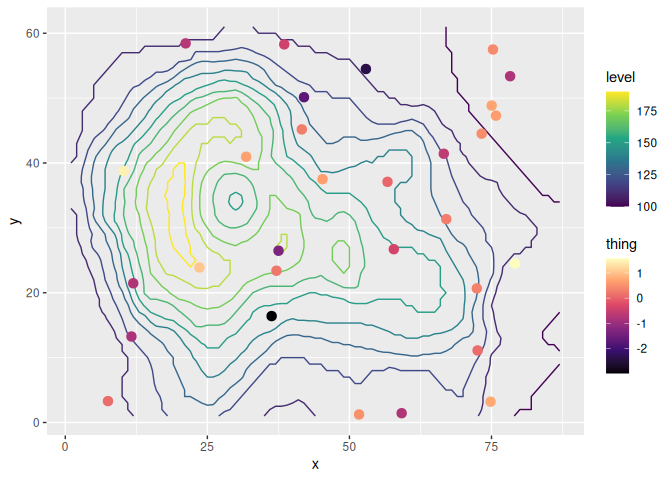

<!-- README.md is generated from README.Rmd. Please edit that file -->

# ggnewscale 

<!-- badges: start -->

[](https://github.com/eliocamp/ggnewscale/actions)
[](https://app.codecov.io/gh/eliocamp/ggnewscale?branch=master)
[](https://zenodo.org/badge/latestdoi/161934647)
[](https://cran.r-project.org/package=ggnewscale)
<!-- badges: end -->

`ggnewscale` tries to make it painless to use multiple scales in
`ggplot2`. Although originally intended to use with colour and fill, it
should work with any `aes`, such as `shape`, `linetype` and the rest.

[ggnewscale: spend 400% more time tweaking your
ggplot!](https://twitter.com/mattansb/status/1524415881920528385)

For another way of defining multiple scales, you can also try
[relayer](https://github.com/clauswilke/relayer).

## How to install

You can install ggnewscale from CRAN with:

``` r
install.packages("ggnewscale")
```

Or the development version with:

``` r
# install.packages("devtools")
devtools::install_github("eliocamp/ggnewscale@dev")
```

## How to cite

If you use ggnewscale in a publication, I’ll be grateful if you cited
it. To get the suggested citation for this (and any other R package) you
can use:

``` r
citation("ggnewscale")
#> 
#> To cite ggnewscale in publications use:
#> 
#>   Campitelli E (2022). _ggnewscale: Multiple Fill and Colour Scales in
#>   'ggplot2'_. doi:10.5281/zenodo.2543762
#>   <https://doi.org/10.5281/zenodo.2543762>, R package version
#>   0.4.7.9000.
#> 
#> A BibTeX entry for LaTeX users is
#> 
#>   @Manual{R-ggnewscale,
#>     title = {ggnewscale: Multiple Fill and Colour Scales in 'ggplot2'},
#>     author = {Elio Campitelli},
#>     year = {2022},
#>     note = {R package version 0.4.7.9000},
#>     doi = {10.5281/zenodo.2543762},
#>   }
```

If you use knitr, [you can automate
this](https://bookdown.org/yihui/rmarkdown-cookbook/write-bib.html) with

``` r
knitr::write_bib(c("ggnewscale"), "packages.bib")
```

And then add citations with `@R-ggnewscale`.

<details>
<summary>
Click to see a list of some publications that have cited ggnewscale.
Thanks!
</summary>

\[1\] E. Akhil Prakash, T. Hromádková, T. Jabir, et al. “Dissemination
of Multidrug Resistant Bacteria to the Polar Environment - Role of the
Longest Migratory Bird Arctic Tern (Sterna Paradisaea)”. In: *Science of
The Total Environment* (Dec. 31, 2021), p. 152727. ISSN: 0048-9697. DOI:
10.1016/j.scitotenv.2021.152727.
<https://www.sciencedirect.com/science/article/pii/S0048969721078062>
(visited on 01/03/2022).

\[2\] R. AminiTabrizi, R. M. Wilson, J. D. Fudyma, et al. “Controls on
Soil Organic Matter Degradation and Subsequent Greenhouse Gas Emissions
Across a Permafrost Thaw Gradient in Northern Sweden”. In: *Frontiers in
Earth Science* 8 (2020). ISSN: 2296-6463. DOI:
10.3389/feart.2020.557961.
<https://www.frontiersin.org/articles/10.3389/feart.2020.557961/full>
(visited on 03/03/2021).

\[3\] X. Ding, K. Liu, Q. Yan, et al. “Sugar and Organic Acid
Availability Modulate Soil Diazotroph Community Assembly and Species
Co-Occurrence Patterns on the Tibetan Plateau”. In: *Applied
Microbiology and Biotechnology* (Oct. 18, 2021). ISSN: 1432-0614. DOI:
10.1007/s00253-021-11629-9. <https://doi.org/10.1007/s00253-021-11629-9>
(visited on 10/21/2021).

\[4\] T. G. Drivas, A. Lucas, and M. D. Ritchie. “eQTpLot: A
User-Friendly R Package for the Visualization of Colocalization between
eQTL and GWAS Signals”. In: *BioData Mining* 14.1 (Jul. 17, 2021), p.
32. ISSN: 1756-0381. DOI: 10.1186/s13040-021-00267-6.
<https://doi.org/10.1186/s13040-021-00267-6> (visited on 07/21/2021).

\[5\] B. D. Golas, B. Goodell, and C. T. Webb. “Host Adaptation to Novel
Pathogen Introduction: Predicting Conditions That Promote Evolutionary
Rescue”. In: *Ecology Letters* 24.10 (2021), pp. 2238-2255. ISSN:
1461-0248. DOI: 10.1111/ele.13845.
<https://onlinelibrary.wiley.com/doi/abs/10.1111/ele.13845> (visited on
03/25/2022).

\[6\] M. C. Granovetter, L. Ettensohn, and M. Behrmann. “With Childhood
Hemispherectomy, One Hemisphere Can Support—But Is Suboptimal for—Word
and Face Recognition”. In: *bioRxiv* (Nov. 08, 2020), p.
2020.11.06.371823. DOI: 10.1101/2020.11.06.371823.
<https://www.biorxiv.org/content/10.1101/2020.11.06.371823v1> (visited
on 03/03/2021).

\[7\] A. T. Hinsu, K. J. Panchal, R. J. Pandit, et al. “Characterizing
Rhizosphere Microbiota of Peanut (Arachis Hypogaea L.) from Pre-Sowing
to Post-Harvest of Crop under Field Conditions”. In: *Scientific
Reports* 11.1 (1 Aug. 31, 2021), p. 17457. ISSN: 2045-2322. DOI:
10.1038/s41598-021-97071-3.
<https://www.nature.com/articles/s41598-021-97071-3> (visited on
09/06/2021).

\[8\] M. Jenckel, I. Smith, T. King, et al. “Distribution and Genetic
Diversity of Hepatitis E Virus in Wild and Domestic Rabbits in
Australia”. In: *Pathogens* 10.12 (12 Dec. 2021), p. 1637. DOI:
10.3390/pathogens10121637. <https://www.mdpi.com/2076-0817/10/12/1637>
(visited on 12/21/2021).

\[9\] H. Jentsch and J. Weidinger. “Spatio-Temporal Analysis of Valley
Wind Systems in the Complex Mountain Topography of the Rolwaling Himal,
Nepal”. In: *Atmosphere* 13.7 (7 Jul. 2022), p. 1138. ISSN: 2073-4433.
DOI: 10.3390/atmos13071138. <https://www.mdpi.com/2073-4433/13/7/1138>
(visited on 08/01/2022).

\[10\] M. Jung, D. Wells, J. Rusch, et al. “Unified Single-Cell Analysis
of Testis Gene Regulation and Pathology in Five Mouse Strains”. In:
*eLife* 8 (Jun. 25, 2019). Ed. by D. Bourc’his, P. J. Wittkopp and S.
Lukassen, p. e43966. ISSN: 2050-084X. DOI: 10.7554/eLife.43966.
<https://doi.org/10.7554/eLife.43966> (visited on 03/03/2021).

\[11\] A. Lan, K. Kang, S. Tang, et al. “Fine-Scale Population Structure
and Demographic History of Han Chinese Inferred from Haplotype Network
of 111,000 Genomes”. In: *bioRxiv* (Jul. 04, 2020), p.
2020.07.03.166413. DOI: 10.1101/2020.07.03.166413.
<https://www.biorxiv.org/content/10.1101/2020.07.03.166413v2> (visited
on 03/03/2021).

\[12\] Z. Lapp, R. Crawford, A. Miles-Jay, et al. “Regional Spread of
blaNDM-1-containing Klebsiella Pneumoniae ST147 in Post-Acute Care
Facilities”. In: *Clinical Infectious Diseases* (ciab457 May. 17, 2021).
ISSN: 1058-4838. DOI: 10.1093/cid/ciab457.
<https://doi.org/10.1093/cid/ciab457> (visited on 05/21/2021).

\[13\] E. Merino Tejero, D. Lashgari, R. García-Valiente, et al.
“Multiscale Modeling of Germinal Center Recapitulates the Temporal
Transition From Memory B Cells to Plasma Cells Differentiation as
Regulated by Antigen Affinity-Based Tfh Cell Help”. In: *Frontiers in
Immunology* 11 (Feb. 05, 2021). ISSN: 1664-3224. DOI:
10.3389/fimmu.2020.620716. pmid: 33613551.
<https://www.ncbi.nlm.nih.gov/pmc/articles/PMC7892951/> (visited on
03/03/2021).

\[14\] G. Papacharalampous, H. Tyralis, S. M. Papalexiou, et al.
“Global-Scale Massive Feature Extraction from Monthly Hydroclimatic Time
Series: Statistical Characterizations, Spatial Patterns and Hydrological
Similarity”. In: *Science of The Total Environment* 767 (May. 01, 2021),
p. 144612. ISSN: 0048-9697. DOI: 10.1016/j.scitotenv.2020.144612.
<https://www.sciencedirect.com/science/article/pii/S0048969720381432>
(visited on 03/03/2021).

\[15\] M. A. Prang, L. Zywucki, M. Körner, et al. “Differences in
Sibling Cooperation in Presence and Absence of Parental Care in a Genus
with Interspecific Variation in Offspring Dependence”. In: *Evolution*
76.2 (2022), pp. 320-331. ISSN: 1558-5646. DOI: 10.1111/evo.14414.
<https://onlinelibrary.wiley.com/doi/abs/10.1111/evo.14414> (visited on
03/25/2022).

\[16\] J. M. Quilty, A. E. Sikorska-Senoner, and D. Hah. “A Stochastic
Conceptual-Data-Driven Approach for Improved Hydrological Simulations”.
In: *Environmental Modelling & Software* (Jan. 16, 2022), p. 105326.
ISSN: 1364-8152. DOI: 10.1016/j.envsoft.2022.105326.
<https://www.sciencedirect.com/science/article/pii/S1364815222000329>
(visited on 01/19/2022).

\[17\] A. Rutz, M. Sorokina, J. Galgonek, et al. “Open Natural Products
Research: Curation and Dissemination of Biological Occurrences of
Chemical Structures through Wikidata”. In: *bioRxiv* (Mar. 01, 2021),
p. 2021.02.28.433265. DOI: 10.1101/2021.02.28.433265.
<https://www.biorxiv.org/content/10.1101/2021.02.28.433265v1> (visited
on 03/07/2021).

\[18\] M. R. Scharn, M. C. G. Brachmann, M. A. Patchett, et al.
*Vegetation Responses to 26 Years of Warming at Latnjajaure Field
Station, Northern Sweden.* <https://doi.org/10.1139/AS-2020-0042>. Apr.
01, 2021. <https://cdnsciencepub.com/doi/abs/10.1139/AS-2020-0042>
(visited on 04/05/2021).

\[19\] L. Seep, Z. Razaghi-Moghadam, and Z. Nikoloski. “Reaction Lumping
in Metabolic Networks for Application with Thermodynamic Metabolic Flux
Analysis”. In: *Scientific Reports* 11.1 (1 Apr. 20, 2021), p. 8544.
ISSN: 2045-2322. DOI: 10.1038/s41598-021-87643-8.
<https://www.nature.com/articles/s41598-021-87643-8> (visited on
04/23/2021).

\[20\] O. Seppälä. “Spatial and Temporal Drivers of Soil Respiration in
a Tundra Environment”. MA Thesis. FACULTY OF SCIENCE DEPARTMENT OF
GEOSCIENCES AND GEOGRAPHY GEOGRAPHY: UNIVERSITY OF HELSINKI, 2020.

\[21\] L. Shah, C. A. Arnillas, and G. B. Arhonditsis. “Characterizing
Temporal Trends of Meteorological Extremes in Southern and Central
Ontario, Canada”. In: *Weather and Climate Extremes* (Jan. 25, 2022),
p. 100411. ISSN: 2212-0947. DOI: 10.1016/j.wace.2022.100411.
<https://www.sciencedirect.com/science/article/pii/S2212094722000056>
(visited on 01/29/2022).

\[22\] C. C. Smith, S. Entwistle, C. Willis, et al. “Landscape and
Selection of Vaccine Epitopes in SARS-CoV-2”. In: *bioRxiv* (Jun. 04,
2020). DOI: 10.1101/2020.06.04.135004. pmid: 32577654.
<https://www.ncbi.nlm.nih.gov/pmc/articles/PMC7302209/> (visited on
03/03/2021).

\[23\] S. N. Thiede, E. S. Snitkin, W. Trick, et al. “Genomic
Epidemiology Suggests Community Origins of Healthcare-Associated USA300
MRSA”. In: *The Journal of Infectious Diseases* (Feb. 16, 2022), p.
jiac056. ISSN: 0022-1899. DOI: 10.1093/infdis/jiac056.
<https://doi.org/10.1093/infdis/jiac056> (visited on 02/26/2022).

\[24\] A. Torres-Espín, A. Chou, J. R. Huie, et al. “Reproducible
Analysis of Disease Space via Principal Components Using the Novel R
Package syndRomics”. In: *eLife* 10 (Jan. 14, 2021). Ed. by M. Zaidi and
M. Barton, p. e61812. ISSN: 2050-084X. DOI: 10.7554/eLife.61812.
<https://doi.org/10.7554/eLife.61812> (visited on 03/03/2021).

\[25\] K. Tougeron and C. Iltis. “Impact of Heat Stress on the Fitness
Outcomes of Symbiotic Infection in Aphids: A Meta-Analysis”. In:
*EcoEvoRxiv* (Mar. 25, 2022). DOI: 10.32942/osf.io/nxdaw.
<https://ecoevorxiv.org/nxdaw/> (visited on 03/25/2022).

\[26\] L. Weidenauer and M. Quadroni. “Phosphorylation in the Charged
Linker Modulates Interactions and Secretion of Hsp90β”. In: *Cells* 10.7
(7 Jul. 2021), p. 1701. DOI: 10.3390/cells10071701.
<https://www.mdpi.com/2073-4409/10/7/1701> (visited on 07/08/2021).

\[27\] D. Wendisch, O. Dietrich, T. Mari, et al. “SARS-CoV-2 Infection
Triggers Profibrotic Macrophage Responses and Lung Fibrosis”. In: *Cell*
(Nov. 27, 2021). ISSN: 0092-8674. DOI: 10.1016/j.cell.2021.11.033.
<https://www.sciencedirect.com/science/article/pii/S0092867421013830>
(visited on 12/11/2021).

\[28\] R. J. Wright, M. G. I. Langille, and T. R. Walker. “Food or Just
a Free Ride? A Meta-Analysis Reveals the Global Diversity of the
Plastisphere”. In: *The ISME Journal* 15.3 (3 Mar. 2021), pp. 789-806.
ISSN: 1751-7370. DOI: 10.1038/s41396-020-00814-9.
<https://www.nature.com/articles/s41396-020-00814-9> (visited on
03/03/2021).

\[29\] T. Wyenberg-Henzler, R. T. Patterson, and J. C. Mallon.
“Ontogenetic Dietary Shifts in North American Hadrosaurids”. In:
*Cretaceous Research* (Feb. 23, 2022), p. 105177. ISSN: 0195-6671. DOI:
10.1016/j.cretres.2022.105177.
<https://www.sciencedirect.com/science/article/pii/S0195667122000416>
(visited on 02/26/2022).

\[30\] A. Yan, J. Butcher, D. Mack, et al. “Virome Sequencing of the
Human Intestinal Mucosal–Luminal Interface”. In: *Frontiers in Cellular
and Infection Microbiology* 10 (Oct. 22, 2020). ISSN: 2235-2988. DOI:
10.3389/fcimb.2020.582187. pmid: 33194818.
<https://www.ncbi.nlm.nih.gov/pmc/articles/PMC7642909/> (visited on
03/03/2021).

\[31\] P. Zannini, F. Frascaroli, J. Nascimbene, et al. “Sacred Natural
Sites and Biodiversity Conservation: A Systematic Review”. In:
*Biodiversity and Conservation* (Sep. 30, 2021). ISSN: 1572-9710. DOI:
10.1007/s10531-021-02296-3. <https://doi.org/10.1007/s10531-021-02296-3>
(visited on 10/04/2021).

\[32\] H. L. Zhang, K. J. Gontjes, J. H. Han, et al. “Characterization
of Resistance to Newer Antimicrobials among Carbapenem-Resistant
Klebsiella Pneumoniae in the Post–Acute-Care Setting”. In: *Infection
Control & Hospital Epidemiology* (Jul. 28, 2022), pp. 1-4. ISSN:
0899-823X, 1559-6834. DOI: 10.1017/ice.2022.185.
<https://www.cambridge.org/core/journals/infection-control-and-hospital-epidemiology/article/abs/characterization-of-resistance-to-newer-antimicrobials-among-carbapenemresistant-klebsiella-pneumoniae-in-the-postacutecare-setting/33D7F100FEF2CA18FBED645D8A268EA8#supplementary-materials>
(visited on 08/01/2022).
</details>

## Usage

The main function is `new_scale()` and its aliases `new_scale_color()`
and `new_scale_fill()`. When added to a plot, every geom added after
them will use a different scale.

As an example, let’s overlay some measurements over a contour map of
topography using the beloved `volcano`.

``` r
library(ggplot2)
library(ggnewscale)
# Equivalent to melt(volcano)
topography <- expand.grid(x = 1:nrow(volcano),
                          y = 1:ncol(volcano))
topography$z <- c(volcano)

# point measurements of something at a few locations
set.seed(42)
measurements <- data.frame(x = runif(30, 1, 80),
                           y = runif(30, 1, 60),
                           thing = rnorm(30))

ggplot(mapping = aes(x, y)) +
  geom_contour(data = topography, aes(z = z, color = stat(level))) +
  # Color scale for topography
  scale_color_viridis_c(option = "D") +
  # geoms below will use another color scale
  new_scale_color() +
  geom_point(data = measurements, size = 3, aes(color = thing)) +
  # Color scale applied to geoms added after new_scale_color()
  scale_color_viridis_c(option = "A")
```

<!-- -->

If you want to create new scales for other `aes`, you can call
`new_scale` with the name of the `aes`. For example, use

``` r
new_scale("linetype")
```

to add multiple linetype scales.
