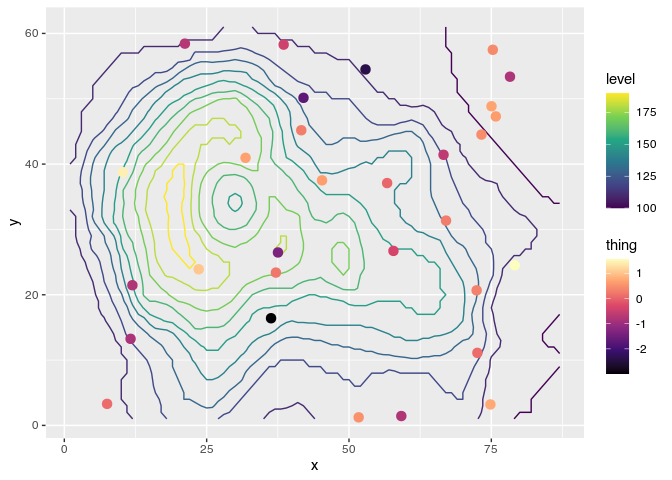

<!-- README.md is generated from README.Rmd. Please edit that file -->

# ggnewscale

[](https://travis-ci.org/eliocamp/ggnewscale)[](https://zenodo.org/badge/latestdoi/161934647)

`ggnewscale` tries to make it painless to use multiple color and fill
scales in `ggplot2`. It’s very experimental, so use at your own risk\!

For another way of defining multiple scales, you can also try
[relayer](https://github.com/clauswilke/relayer).

## Installation

`ggnewscale` is not on CRAN. You can install the latest release from
[GitHub](https://github.com/) with

``` r
# install.packages("devtools")
devtools::install_github("eliocamp/ggnewscale@v0.1.0")
```

Or you can install the latest commit with

``` r
# install.packages("devtools")
devtools::install_github("eliocamp/ggnewscale")
```

## Usage

The main function is `new_scale()` and its aliases `new_scale_color()`
and `new_scale_fill()`. When added to a plot, every geom added after
them will use a different scale.

As an example, let’s overlay some measurements over a contour map of
topography using the beloved `volcano`.

``` r
library(ggplot2)
library(ggnewscale)
# Equivalent to melt(volcano)
topography <- expand.grid(x = 1:nrow(volcano),
                          y = 1:ncol(volcano))
topography$z <- c(volcano)

# point measurements of something at a few locations
set.seed(42)
measurements <- data.frame(x = runif(30, 1, 80),
                           y = runif(30, 1, 60),
                           thing = rnorm(30))

ggplot(mapping = aes(x, y)) +
  geom_contour(data = topography, aes(z = z, color = stat(level))) +
  # Color scale for topography
  scale_color_viridis_c(option = "D") +
  # geoms below will use another color scale
  new_scale_color() +
  geom_point(data = measurements, size = 3, aes(color = thing)) +
  # Color scale applied to geoms added after new_scale_color()
  scale_color_viridis_c(option = "A")
```


